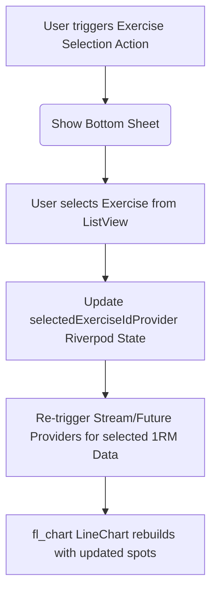

# Grit Visual Overhaul & Tech-Kawaii UI Polish Handoff

*Timestamp: 2026-06-12T21:27:05+08:00*

---

## 1. Feature Objective & Context

The core objective of this initiative was to execute a comprehensive visual overhaul of the **Grit** gym tracking application, shifting from legacy, informal emoji markers to a premium, unified **Tech-Kawaii / Wii U** design system. Emojis have been fully replaced with crisp, scalable **Material Icons** across all primary user-facing screens. 

### Key Objectives:
- **Design Consistency**: Enforce the `GritTheme` aesthetic (pastel tones, high-contrast borders, large corner radiuses, and Nunito typography) system-wide.
- **UX Modernization**: Transition legacy dropdown fields (such as the exercise progressive overload selector in the Analytics screen) into mobile-first, user-friendly **modal bottom sheets** powered by `DraggableScrollableSheet`.
- **Layout Robustness**: Eliminate visual clipping and layout overflows on consistency and progression charts by expanding axis title sizing and reserving sufficient boundaries for label text dynamically.

---

## 2. Files Modified & Architecture Impact

### `lib/ui/theme.dart`
- **Purpose**: Defines color constants, gradients (primary, accent, success, and warm accents), borders, and typography.
- **Impact**: Establishes the layout tokens for all card borders and buttons, reinforcing the tech-kawaii visual style.

### `lib/ui/analytics_screen.dart`
- **Purpose**: Displays charts of user workout statistics, muscle group splits, and 1RM progress.
- **Impact**: Replaced standard dropdown with `_showExerciseSelectorBottomSheet` modal sheet, adjusted axis label spacing on the `LineChart` and `BarChart` to prevent text clipping.

### `lib/ui/dashboard_screen.dart`
- **Purpose**: Home feed showing workout streak, recent template list, and previous logs.
- **Impact**: Cleaned up title headers, modernized "Build Program" banner card, and refactored `_buildEmptyState` to receive dynamic `IconData`.

### `lib/ui/exercise_detail_screen.dart`
- **Purpose**: Details individual movement history and charts the 1RM progression curve over time.
- **Impact**: Rewrote `_buildSectionLabel` to accept icons instead of Unicode emoji sequences; expanded leftTitles' `reservedSize` to `40`.

### `lib/ui/exercise_library_screen.dart`
- **Purpose**: Central archive for pre-seeded and user-created custom movements.
- **Impact**: Removed emojis from the screen header and the custom exercise creation dialog titles, aligning them with the rest of the application's clean design.

### `lib/ui/main_navigation_host.dart`
- **Purpose**: Holds page indices and houses the custom bottom navigation bar as well as the active floating workout bar.
- **Impact**: Standardized navigation tab layouts and icons to match the design system.

### `lib/ui/program_questionnaire_screen.dart`
- **Purpose**: Questionnaire wizard interface for automatically seeding customized workout routines.
- **Impact**: Replaced unicode star characters in the appBar with the standard `Icons.auto_awesome_rounded` icon.

### `lib/ui/settings_screen.dart`
- **Purpose**: Configuration panel for data management (export/import) and system settings.
- **Impact**: Modernized settings header and converted the About section to feature a styled header row containing a clean Material flash icon.

### `lib/ui/workout_logger_screen.dart`
- **Purpose**: Interactive logsheet for active workouts.
- **Impact**: Removed emoji markers from input placeholder text, cancel dialogs, completion alerts, and exercise selection overlays.

### `README.md`
- **Purpose**: Repository overview and setup instructions.
- **Impact**: Overhauled layout to document the new visual identity guidelines and mobile UI standards.

---

## 3. Key Code Implementations

### A. Modal Bottom Sheet for Exercise Selection (`lib/ui/analytics_screen.dart`)
This widget replaces the default Flutter dropdown, providing a draggable bottom sheet for selecting the active exercise:

```dart
  void _showExerciseSelectorBottomSheet(BuildContext context, WidgetRef ref, List<Exercise> exercises, Exercise? selected) {
    showModalBottomSheet(
      context: context,
      isScrollControlled: true,
      backgroundColor: Colors.transparent,
      builder: (_) {
        return DraggableScrollableSheet(
          initialChildSize: 0.6,
          maxChildSize: 0.9,
          minChildSize: 0.4,
          expand: false,
          builder: (context, scrollController) {
            return Container(
              decoration: const BoxDecoration(
                color: GritTheme.surface,
                borderRadius: BorderRadius.vertical(top: Radius.circular(24)),
              ),
              child: Column(
                children: [
                  const SizedBox(height: 12),
                  Container(
                    width: 40,
                    height: 4,
                    decoration: BoxDecoration(color: GritTheme.divider, borderRadius: BorderRadius.circular(10)),
                  ),
                  const SizedBox(height: 16),
                  const Row(
                    mainAxisAlignment: MainAxisAlignment.center,
                    children: [
                      Icon(Icons.fitness_center_rounded, color: GritTheme.primary),
                      SizedBox(width: 8),
                      Text('Select Exercise', style: TextStyle(fontWeight: FontWeight.w800, fontSize: 16)),
                    ],
                  ),
                  const SizedBox(height: 12),
                  Expanded(
                    child: ListView.builder(
                      controller: scrollController,
                      itemCount: exercises.length,
                      itemBuilder: (context, idx) {
                        final ex = exercises[idx];
                        final isSel = selected?.id == ex.id;
                        return ListTile(
                          title: Text(ex.name, style: TextStyle(fontWeight: isSel ? FontWeight.w800 : FontWeight.normal)),
                          trailing: isSel ? const Icon(Icons.check_circle_rounded, color: GritTheme.primary) : null,
                          onTap: () {
                            ref.read(selectedExerciseIdProvider.notifier).state = ex.id;
                            Navigator.pop(context);
                          },
                        );
                      },
                    ),
                  ),
                ],
              ),
            );
          },
        );
      },
    );
  }
```

### B. Standardized Section Header Utility (`lib/ui/exercise_detail_screen.dart`)
Used to present styled screen sub-headers consistently with supporting Material Icons:

```dart
  Widget _buildSectionLabel(String text, IconData icon) {
    return Row(
      children: [
        Icon(icon, size: 20, color: GritTheme.primary),
        const SizedBox(width: 8),
        Expanded(
          child: Text(
            text,
            style: const TextStyle(
              fontFamily: 'Nunito',
              fontSize: 17,
              fontWeight: FontWeight.w800,
              color: GritTheme.textPrimary,
            ),
            overflow: TextOverflow.ellipsis,
          ),
        ),
      ],
    );
  }
```

### C. Standardized Empty States (`lib/ui/dashboard_screen.dart`)
Dynamically accepts icons to statefully prompt users on unconfigured views:

```dart
  Widget _buildEmptyState(String text, Color color, IconData icon) {
    return Container(
      padding: const EdgeInsets.symmetric(vertical: 32, horizontal: 16),
      decoration: BoxDecoration(
        color: color.withValues(alpha: 0.06),
        borderRadius: BorderRadius.circular(20),
        border: Border.all(color: color.withValues(alpha: 0.2), width: 1.5),
      ),
      child: Center(
        child: Column(
          mainAxisSize: MainAxisSize.min,
          children: [
            Icon(icon, color: color, size: 28),
            const SizedBox(height: 10),
            Text(
              text,
              textAlign: TextAlign.center,
              style: TextStyle(color: GritTheme.textSecondary, fontSize: 14, fontWeight: FontWeight.w600),
            ),
          ],
        ),
      ),
    );
  }
```

---

## 4. Data Models & Data Flow



- **UI State**: Managed via simple Riverpod StateProviders (`selectedExerciseIdProvider`). Re-logging or selecting a different index triggers automatic cache invalidation and database select queries.
- **Plate Calculator Modal State**: Passes double values (target weight) through standard stateful constructor variables to resolve the exact distribution of plates dynamically.

---

## 5. Next Steps for R&D

- **Contrast Validation**: Verify that the text visibility on the light-themed containers (e.g., `color.withValues(alpha: 0.06)`) matches accessibility standards across low-contrast mobile screens.
- **Target Device Testing**: Test bottom sheet layouts on compact mobile displays (such as iPhone SE or small Android models) to ensure no scrollable boundaries clip or trigger keyboard overlaps.
- **Theme Testing**: Validate custom chart rendering options if dark theme options are introduced in later stages.
